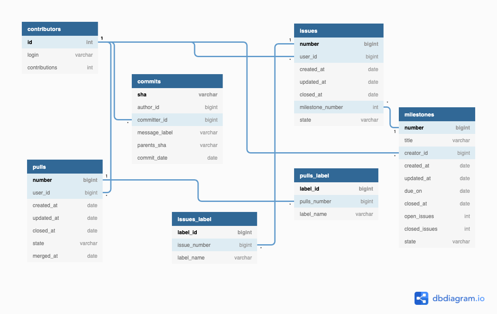

# GitHub Repo Explorer
A project that uses Python, GitHub RESTful API, BeautifulSoup (a web scraping library), PostgreSQL(psycopg2) and ironically Pandas library to build a repository explorer that provide insights on [Pandas repository](https://github.com/pandas-dev/pandas). The code in this repository, however, could be used to explore any GitHub repository.

# Necessary installations for running the code
```
pip3 install plotly
pip3 install psycopg2
pip3 install beautifulsoup4
```

# Running the Code

### **Step 1:** Generating JSON files by callin GitHub RESTful API endpoints
```cd generate_json_data_script/ ```

```python3 generate_json_data_files.py ```

The script calls 3 endpoints (issues, commits, contributors) and generate the following files:
```
issues_and_pulls.json
commits.json
contributors.json
```
in the **json_response** directory.

*Note*: https://api.github.com/repos/{username}/{repo_name}/issues  fetches both issues and pull requests so I didn't call *pulls* endpoint. Instead, I seperated them later during data pre-processing step.

Also note: I haven't included issues_and_pulls.json and commits.json file in the repo because of large file size.

### **Step 2:**  Data pre-processing and file conversion from JSON to CSV.

``` cd json_to_csv_script/ ```

```python3 commits_json_to_csv.py```

```python3 contributors_json_to_csv.py```

```python3 milestones_json_to_csv.py```

```python3 issues_and_pulls_json_to_csv.py```

This will generate the following .csv files
```
commits.csv
contributors.csv
issues.csv
pulls.csv
milestone.csv
```
in the **csv_files** directory.

### **Step 3:** Creating tables in a postgreSQL database 

Set up a postgreSQL database and run the following command:

``` psql -d {database_name}```

```\i create_tables/all_tables.sql```

This will create the following tables in your database based on the above schema.
```
commits
contributors
issues
milestones
pulls
issues_label
pulls_label
```
Check out below to learn more about the schema design and the columns in each of those tables.

# Repository Schema Design

All the table names and column names in the designed schema are pretty much self-explainatory. The relations between tables are shown with an arrow. 




# Schema test with the SQL Exploration

The following Jupyter Notebook file demonstrates that the above schema design could find answers to interesting repository insights with SQL queries.

```eda_script/sample_sql_questions_test.ipynb```

# Exploratory Data Analysis

The following Jupyter Notebook file performs exploratory data analysis on the Pandas repository with the collected data.

```eda_script/pandas_analysis.ipynb```

# Repository Overview

The following script implements a class that fetches the basic overview of the repo like number of stars, number of forks from the repository home page with a single API call.

```repo_overview_script/repo_overview.py```

# Activity Report

The following file is an activity report that breifly summarizes the findings and insights on Pandas repository.

```report/pandas_activity_report.pdf```


