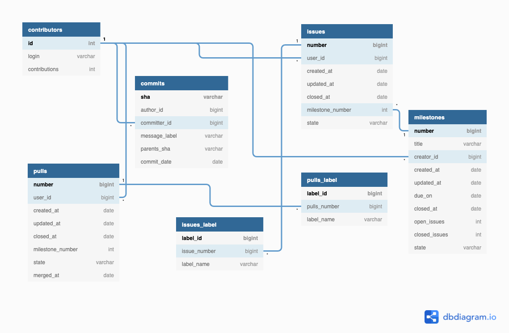

# Pandas Repo Explorer


# Schema Design




# Running the Code

### **Step 1:** Generating JSON files by callin GitHub RESTful API endpoints
```cd generate_json_data_script/ ```

```python3 generate_json_data_files.py ```

The script calls 3 endpoints (issues, commits, contributors) and generate the following files:
```
issues_and_pulls.json
commits.json
contributors.json
```
in the **json_response** directory.

*Note*: https://api.github.com/repos/{username}/{repo_name}/issues  fetches both issues and pull requests so I didn't call *pulls* endpoint. Instead, I seperated them later during data pre-processing step.

### **Step 2:**  Data pre-processing and file conversion from JSON to CSV.

``` cd json_to_csv_script/ ```

```python3 commits_json_to_csv.py```

```python3 contributors_json_to_csv.py```

```python3 milestones_json_to_csv.py```

```python3 issues_and_pulls_json_to_csv.py```

This will generate the following files
```
issues.csv
pulls.csv
commits.csv
contributors.csv
```
in the **csv_files** directory.

### **Step 3:** Creating tables in a postgreSQL database 

Set up a postgreSQL database and run the following command:

``` psql -d {database_name}```

```\i create_tables/all_tables.sql```

This will create the following tables in your database based on the above schema.
```
commits
contributors
issues
milestones
pulls
issues_label
pulls_label
```


